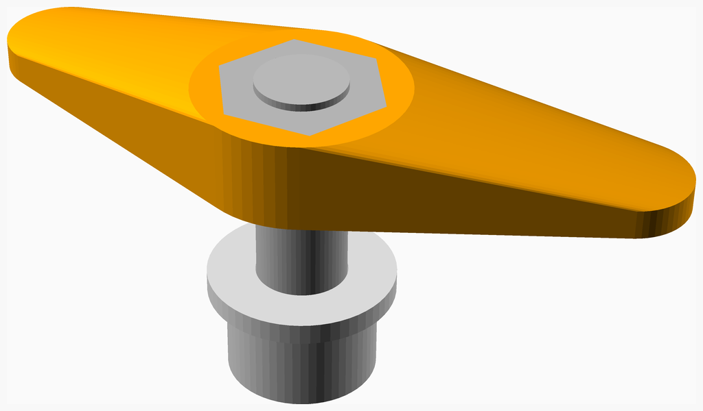
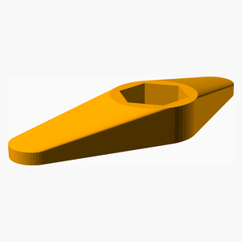
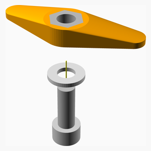

# RevA

---
## Table of Contents
1. [Parts list](#Parts_list)
1. [Main Assembly](#main_assembly)

[Top](#TOP)

---

## Parts list
| Main | TOTALS |  |
|---:|---:|:---|
|  | | **Vitamins** |
| &nbsp;&nbsp;1&nbsp; |  &nbsp;&nbsp;1&nbsp; | &nbsp;&nbsp; Nut M6 x 5mm  |
| &nbsp;&nbsp;1&nbsp; |  &nbsp;&nbsp;1&nbsp; | &nbsp;&nbsp; Screw M6 cap x 16mm |
| &nbsp;&nbsp;1&nbsp; |  &nbsp;&nbsp;1&nbsp; | &nbsp;&nbsp; Washer  M6 x 12.5mm x 1.5mm |
| &nbsp;&nbsp;3&nbsp; | &nbsp;&nbsp;3&nbsp; | &nbsp;&nbsp;Total vitamins count |
|  | | **3D printed parts** |
| &nbsp;&nbsp;1&nbsp; |  &nbsp;&nbsp;1&nbsp; | &nbsp;&nbsp;NutHelper.stl |
| &nbsp;&nbsp;1&nbsp; | &nbsp;&nbsp;1&nbsp; | &nbsp;&nbsp;Total 3D printed parts count |

[Top](#TOP)

---

## Main Assembly
### Vitamins
|Qty|Description|
|---:|:----------|
|1| Nut M6 x 5mm |
|1| Screw M6 cap x 16mm|
|1| Washer  M6 x 12.5mm x 1.5mm|

### 3D Printed parts

| 1 x NutHelper.stl |
|---|
|  

### Assembly instructions

1. Push nit into NutHelper

[Top](#TOP)
